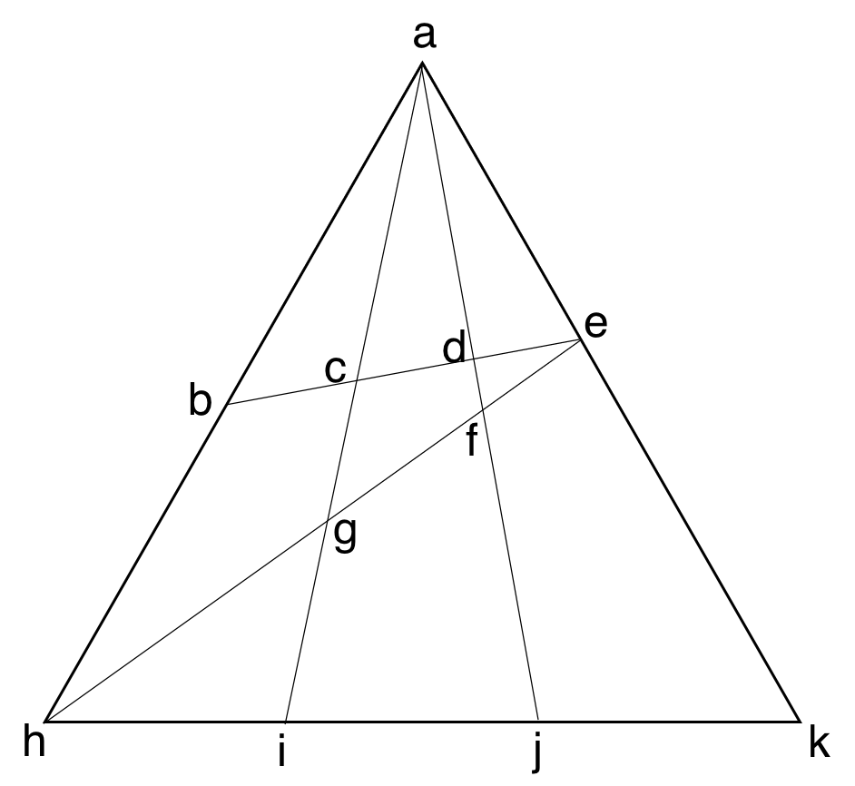

# DDD sample

### cargo

DDD sample with OO

## counting shapes

DDD sample with FP

### counting triangles
How many triangles can you see?
24, details as follows:
[abc abd abe acd ace ade aef aeg aeh afg afh agh ahi ahj ahk aij aik ajk beh ceg def ehk fhj ghi]

### counting quadrangles
How many quadrangles can you see?
18, details as follows:
[aceh adeg adeh afhk aghj aghk bcgh bcih bdfh bdjh bekh cdfg cdji ceki dekj efjk egik fgij]
